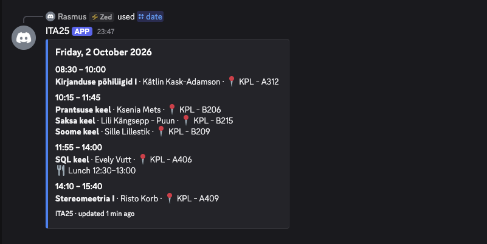

# ITA25 Bot

A Discord bot that shows the ITA25 class timetable from VOCO Siseveeb, right in chat.

[](https://www.rust-lang.org/)
[](LICENSE)



## Features

- **Lessons grouped by time slot**: parallel lessons like language electives are shown together.
- **The details you need**: teacher, room or online, lunch breaks, notes, and a "until HH:MM" mark when a lesson ends early.
- **Tallinn time**: "today" is always the school's today, and `/tomorrow` on a Friday or weekend jumps to Monday.
- **Fast and resilient**: each week is cached for 30 minutes. If Siseveeb is down, the bot shows the last timetable it has, with a warning in the footer.

## Commands

| Command | What it does |
| --- | --- |
| `/today` | Today's lessons |
| `/tomorrow` | The next school day's lessons (on Friday: Monday) |
| `/date <day>` | Lessons on any date. Accepts `02.10.2026`, `02.10.26`, `2026-10-02` or just `2.10` |
| `/ping` | Gateway latency and round trip |
| `/uptime` | How long the bot has been running |

## Running it yourself

You need [Rust](https://rustup.rs/) 1.85 or newer and a Discord bot token.

1. **Create a bot**: in the [Discord Developer Portal](https://discord.com/developers/applications), make a new application, open **Bot** and copy the token.
2. **Invite it**: under **OAuth2 → URL Generator**, tick the `bot` and `applications.commands` scopes and open the generated link. No privileged intents are needed.
3. **Run it**:

   ```sh
   git clone https://github.com/rasmus-antsi/ITA25-bot-rust.git
   cd ITA25-bot-rust
   cp .env.example .env   # then paste your token into .env
   cargo run --release
   ```

Slash commands are registered globally on startup, so the first time it can take a few minutes before they show up in Discord.

### Using it for another group

The group is set by two constants at the top of [`src/main.rs`](src/main.rs):

```rust
const ITA25_GROUP_ID: u32 = 2078;
const GROUP_NAME: &str = "ITA25";
```

To find your group's ID, open your timetable in [Siseveeb](https://siseveeb.voco.ee/veebivormid/tunniplaan/tunniplaan) and look for the `oppegrupp=` number in the URL.

## How it works

Siseveeb has no public API, so the bot reads the timetable page itself:

1. [`schedule.rs`](src/schedule.rs) fetches the week containing the requested date and caches it.
2. [`scraper.rs`](src/scraper.rs) cuts the `events:` array out of the page's inline JavaScript, parses it as JSON5 and turns each event into a `Lesson`.
3. [`timetable.rs`](src/timetable.rs) sorts lessons and groups those that start together into slots.
4. [`render.rs`](src/render.rs) turns a day into plain text fields (easy to test), and [`commands.rs`](src/commands.rs) sends them as a Discord embed.

[`dates.rs`](src/dates.rs) handles the Tallinn time zone and date parsing.

## Development

```sh
cargo test     # runs offline against tests/fixtures/ita25_week.html
cargo fmt
cargo clippy
```

The fetch tests start a tiny local HTTP server, so no network or Discord token is needed.

Issues and pull requests are welcome.

## Disclaimer

This is an unofficial student project and is not affiliated with VOCO. The data comes from the public Siseveeb timetable and can be up to 30 minutes old, so check Siseveeb for anything important.

## License

[MIT](LICENSE)
